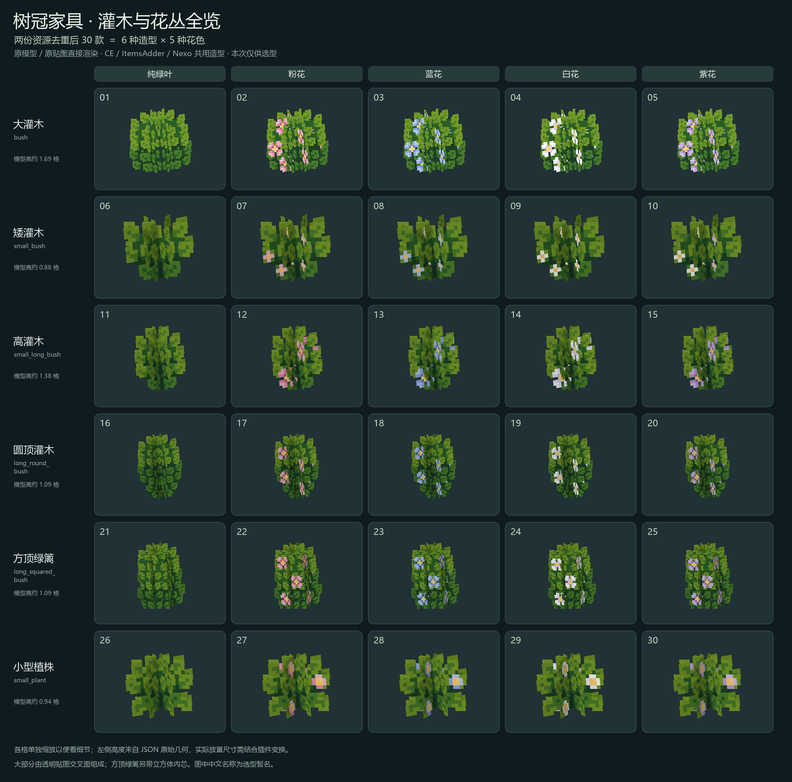

# 树冠家具资源分析与选型清单

两份目录是同一套 ShizuArt Bush Props 灌木装饰资源的不同插件适配，不是两套不同家具。去重后 30 款，没有桌椅柜子。

## 两份目录的关系

- `2013CE树冠家具0.2`：CraftEngine 版，30 个 Minecraft JSON 模型、1 张 256×256 透明 PNG 图集，以及物品/分类 YAML。
- `2013树冠家具`：ItemsAdder 版和 Nexo 版。ItemsAdder 为散装资源，Nexo 资源放在 ZIP 内。各含同样 30 个模型。
- CE 与 ItemsAdder 逐字段比较，只有纹理引用路径不同；几何、UV、旋转、显示变换相同。
- Nexo ZIP 与 ItemsAdder 的 JSON 只存在 `mcmodels` 元数据差异；3 份纹理解码后的像素完全一致。
- 3 种插件配置各列出 30 / 30 / 30 个物品。

## 选型编号

中文名称为方便选择而暂译；`long` 系列按外观标注圆顶/方顶，不能仅凭英文文件名当作两格长家具。

| 编号 | 暂译名称 | 原模型文件名 | 元素数 | 原始几何高度（格） |
|---|---|---|---:|---:|
| 01 | 大灌木 · 纯绿叶 | `bush.json` | 4 | 1.69 |
| 02 | 大灌木 · 粉花 | `bush_pink_flowers.json` | 4 | 1.69 |
| 03 | 大灌木 · 蓝花 | `bush_blue_flowers.json` | 4 | 1.69 |
| 04 | 大灌木 · 白花 | `bush_white_flowers.json` | 4 | 1.69 |
| 05 | 大灌木 · 紫花 | `bush_purple_flowers.json` | 4 | 1.69 |
| 06 | 矮灌木 · 纯绿叶 | `small_bush.json` | 4 | 0.88 |
| 07 | 矮灌木 · 粉花 | `small_bush_pink_flowers.json` | 4 | 0.88 |
| 08 | 矮灌木 · 蓝花 | `small_bush_blue_flowers.json` | 4 | 0.88 |
| 09 | 矮灌木 · 白花 | `small_bush_white_flowers.json` | 4 | 0.88 |
| 10 | 矮灌木 · 紫花 | `small_bush_purple_flowers.json` | 4 | 0.88 |
| 11 | 高灌木 · 纯绿叶 | `small_long_bush.json` | 4 | 1.38 |
| 12 | 高灌木 · 粉花 | `small_long_bush_pink_flowers.json` | 4 | 1.38 |
| 13 | 高灌木 · 蓝花 | `small_long_bush_blue_flowers.json` | 4 | 1.38 |
| 14 | 高灌木 · 白花 | `small_long_bush_white_flowers.json` | 4 | 1.38 |
| 15 | 高灌木 · 紫花 | `small_long_bush_purple_flowers.json` | 4 | 1.38 |
| 16 | 圆顶灌木 · 纯绿叶 | `long_round_bush.json` | 4 | 1.09 |
| 17 | 圆顶灌木 · 粉花 | `long_round_bush_pink_flowers.json` | 4 | 1.09 |
| 18 | 圆顶灌木 · 蓝花 | `long_round_bush_blue_flowers.json` | 4 | 1.09 |
| 19 | 圆顶灌木 · 白花 | `long_round_bush_white_flowers.json` | 4 | 1.09 |
| 20 | 圆顶灌木 · 紫花 | `long_round_bush_purple_flowers.json` | 4 | 1.09 |
| 21 | 方顶绿篱 · 纯绿叶 | `long_squared_bush.json` | 5 | 1.09 |
| 22 | 方顶绿篱 · 粉花 | `long_squared_bush_pink_flowers.json` | 5 | 1.09 |
| 23 | 方顶绿篱 · 蓝花 | `long_squared_bush_blue_flowers.json` | 5 | 1.09 |
| 24 | 方顶绿篱 · 白花 | `long_squared_bush_white_flowers.json` | 5 | 1.09 |
| 25 | 方顶绿篱 · 紫花 | `long_squared_bush_purple_flowers.json` | 5 | 1.09 |
| 26 | 小型植株 · 纯绿叶 | `small_plant.json` | 4 | 0.94 |
| 27 | 小型植株 · 粉花 | `small_plant_pink_flowers.json` | 4 | 0.94 |
| 28 | 小型植株 · 蓝花 | `small_plant_blue_flowers.json` | 4 | 0.94 |
| 29 | 小型植株 · 白花 | `small_plant_white_flowers.json` | 4 | 0.94 |
| 30 | 小型植株 · 紫花 | `small_plant_purple_flowers.json` | 4 | 0.94 |

## 模型实现时需要留意

- 25 款使用 4 张透明交叉面，方顶绿篱的 5 款使用 4 张交叉面 + 1 个立方体内芯。不是精细实体叶片模型，也不是完整树木。
- 共用一张 256×256 图集，叶片/花朵本身为像素画。渲染必须保留透明裁切、UV、双面朝向，以及各元素原有的 `shade` 设置和模型的 `ambientocclusion` 设置。
- 未发现 Blockbench `.bbmodel`、骨骼模型、模型动画或动画贴图元数据；源文件为 Minecraft JSON，可导入 Blockbench 编辑。
- 原始几何高度约 0.88–1.69 格，部分 X/Z 超出单格范围，部分模型底部位于 y=4 或 y=-1。游戏内落地位置、选框和占地需要按最终用途单独处理。
- 原配置使用插件的 item_display 家具机制，不能把 YAML 直接搬进 NeoForge；只需从一份模型和图集中选取资源，再实现极光自己的方块、掉落和放置规则。
- 三种适配的行为配置并不相同，例如 CE 使用石头放置/破坏音效，ItemsAdder/Nexo 使用樱花树叶音效。这不是模型差异。

## 原 Nexo 配置中的掉落引用问题

以下条目的 `nexo_item` 与自身物品键不一致；缺失项会找不到对应定义，指向其他款式的项目会产生错款掉落（本次不修改原文件）。

| 原物品键 | 掉落引用 | 引用是否存在 |
|---|---|---|
| `bush2` | `bush` | 本配置未定义 |
| `bush_blue_flower2` | `bush_pink_flowers2` | 存在，但非自身 |
| `bush_white_flower2` | `bush_pink_flowers2` | 存在，但非自身 |

## 本次验证

解析了 CE、ItemsAdder、Nexo ZIP 内全部 90 个模型 JSON，并比较几何与显示变换、核对三份图集像素；30 款均已用原模型、原 UV 和原贴图生成预览。
未修改原始资源包或极光运行资源；尚未做 NeoForge 游戏内接入及碰撞验证。
